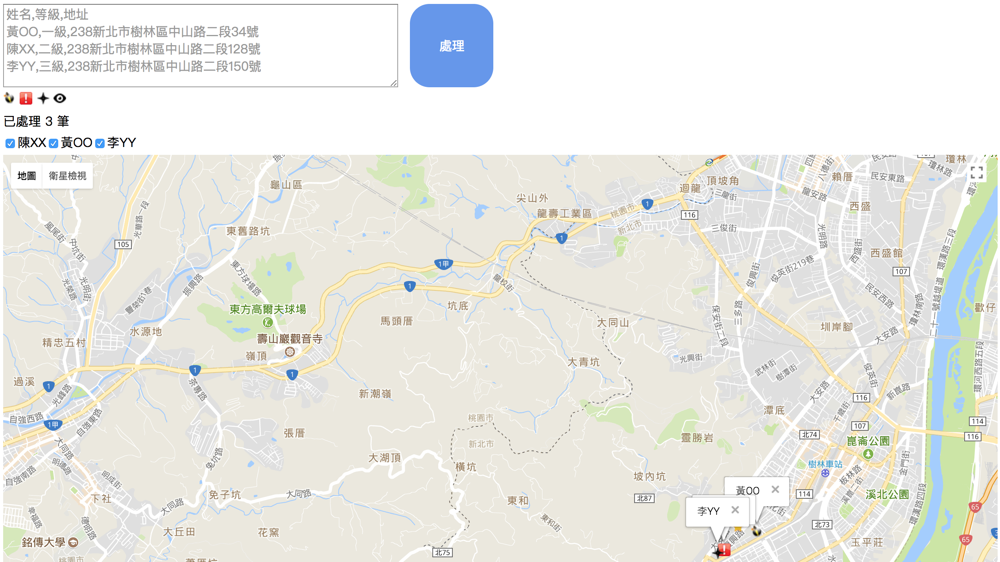
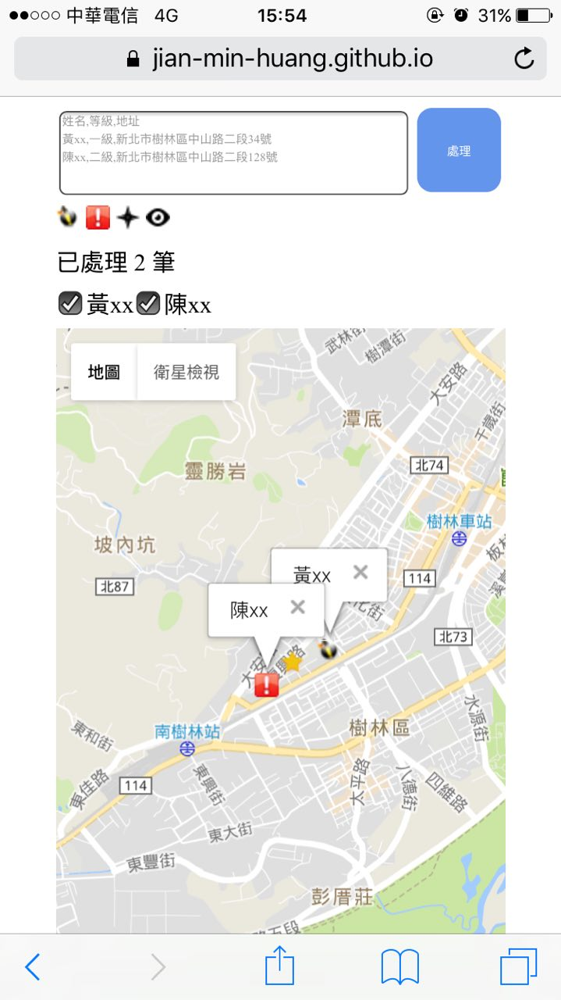

# 🗺 quick-map-4-jean  [](https://travis-ci.org/Jian-Min-Huang/quick-map-4-jean)
Quick Map for Jean's Business

# Input Format (.csv), you can press enter button directly
```
name1,level1,address1
name2,level2,address2
name3,level3,address3
...
```

# Desktop Screen


# Mobile Screen


# Requirements
* [Node.js][nodejs-page]
* [npm][npm-page] or [yarn][yarn-page]
* [Gulp.js][gulpjs-page]

# Project Structure
```
* build/                        build result
* src/
  * html/                       html files
  * js/                         js files
  * css                         css files
* vendors                       3rd party libraries
```

# Build
```sh
$ npm install
$ npm run build
```

# Result
please visit [http://jean.jianminhuang.cc][result-page]

# Author
Jian-Min Huang

# License
[MIT License][license-page]

Copyright (c) 2017 Jian-Min Huang

[:arrow_up: back to top][top-page]

[result-page]: <http://jean.jianminhuang.cc>
[license-page]: <https://github.com/Jian-Min-Huang/quick-map-4-jean/blob/master/LICENSE>
[top-page]: <https://github.com/Jian-Min-Huang/quick-map-4-jean#quick-map-4-jean>