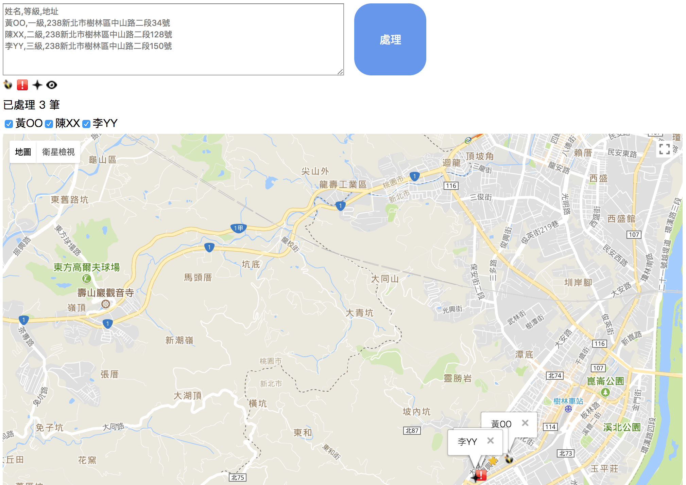
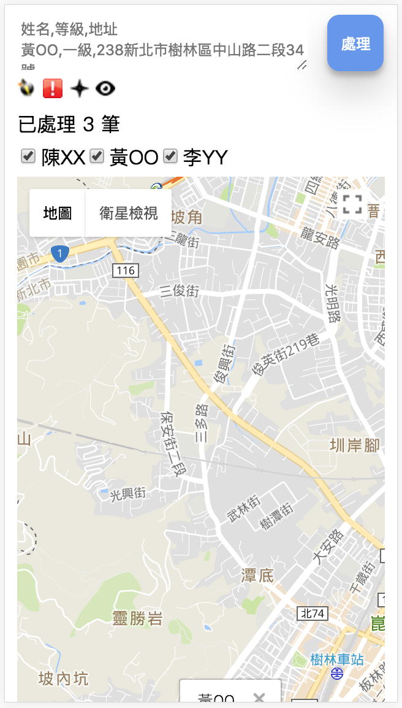

# quick map 4 jean
> http://jean.jianminhuang.cc

# input format (.csv), you can press enter button directly
```
name1,level1,address1
name2,level2,address2
name3,level3,address3
...
```

# desktop screen


# mobile screen


# Authors
Jian-Min Huang

# License
[MIT License][license-page]

Copyright (c) 2017 Jian-Min Huang

[:arrow_up: back to top][top-page]
  
[license-page]: <https://github.com/Jian-Min-Huang/quick-map-4-jean/LICENSE>
[top-page]: <https://github.com/Jian-Min-Huang/quick-map-4-jean#quick-map-4-jean>