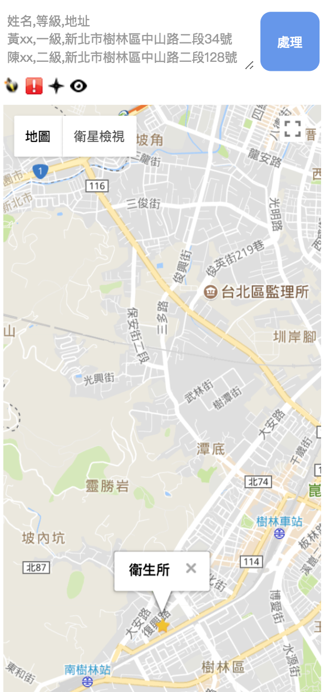

# 🗺 quick-map-4-jean    
Quick Map for Jean's Business

# Input Format (.csv)
```
name1,level1,address1
name2,level2,address2
name3,level3,address3
...
```

# Desktop Screen Shot


# Mobile Screen Shot


# Requirements
* [Node.js][nodejs-page]
* [npm][npm-page] or [yarn][yarn-page]
* [Gulp.js][gulpjs-page]

# Project Structure
```
* build/                        build result
* src/
  * html/                       html files
  * js/                         js files
  * css                         css files
* vendors                       3rd party libraries
```

# Build
```sh
$ npm install
$ npm run build
```

# Result
please visit [https://jian-min-huang.github.io/quick-map-4-jean/][result-page]

# Author
Jian-Min Huang

# License
[MIT License][license-page]

Copyright (c) 2017 Jian-Min Huang

[:arrow_up: back to top][top-page]

[nodejs-page]: <https://nodejs.org>
[npm-page]: <https://www.npmjs.com>
[yarn-page]: <https://yarnpkg.com>
[gulpjs-page]: <https://gulpjs.com>
[result-page]: <http://jean.jianminhuang.cc>
[license-page]: <https://github.com/Jian-Min-Huang/quick-map-4-jean/blob/master/LICENSE>
[top-page]: <https://github.com/Jian-Min-Huang/quick-map-4-jean#quick-map-4-jean>
